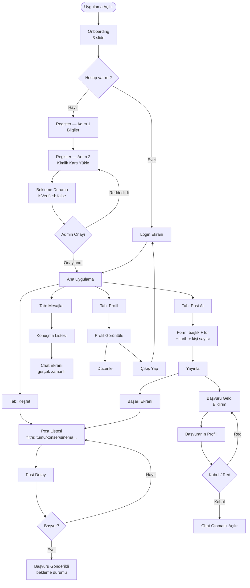

# UniNode — User Flow

Mermaid formatında. [mermaid.live](https://mermaid.live) adresine yapıştırarak görselleştirebilirsin.

---

## Ekran Listesi (Özet)

| # | Ekran | Açıklama |
|---|---|---|
| 1 | Onboarding | 3 slide, değer önerisi |
| 2 | Login | Email + şifre |
| 3 | Register — Bilgiler | Ad, üniversite, email, şifre |
| 4 | Register — Kimlik | Kart fotoğrafı yükleme |
| 5 | Bekleme | isVerified: false durumu |
| 6 | Feed | Filtreli post listesi |
| 7 | Post Detay | Açıklama + başvur butonu |
| 8 | Post Oluştur | Form + yayınla |
| 9 | Mesajlar | Konuşma listesi |
| 10 | Chat | Gerçek zamanlı mesajlaşma |
| 11 | Profil | Stats + ilgi alanları + ayarlar |
